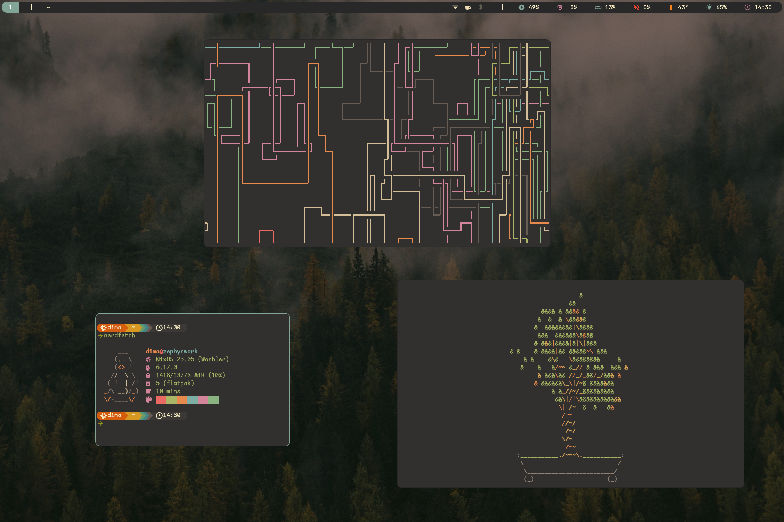
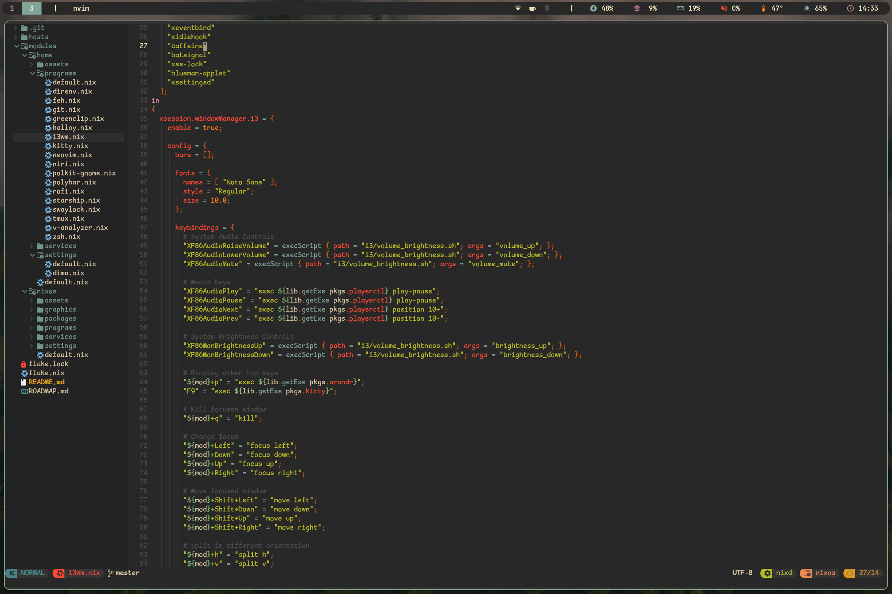

# NixOS configuration
This is my nixos configuration. Fully reproducible, using home-manager.

## Machines:
- Zephyr: Dell Latitude 3420 (Intel i3-1125G4, 12GB, 256GB), Dualbooted with Windows 10 (50GB for W10)
- Zephyrwork: Framework Laptop 13 (AMD Ryzen 5 7640u, 16GB, 1TB)

## Information
This config does not support arm/riscv at all, but it's probably possible to make it work with some modifications. This mostly comes down to some packages not having the support for this architecture.

### Versions
This configuration uses NixOS 25.05 as base, with a couple modifications:
- Cachyos Release Candidate Kernel
- Mesa drivers from nixos-unstable
- Couple more packages from nixos-unstable
- Custom packages (need to be built on-machine)

### Zephyr
Due to the machine being low on storage, this is the most lightweight setup I could possibly write for it without compromising too much

### Zephyrwork
This machine has a lot of storage (compaired to zephyr) so this includes tons of application. But this includes a few hardware specific touches too:
1. Added fingerprint support.
2. Includes a small config for niri (the window manager).
3. Includes a setup for QEMU/KVM

### Small differences
The configs also have a couple differences in some utilities between machines:
- Power Management: Zephyr uses TLP, while Zephyrwork uses auto-cpufreq.
- UI: Polybar and i3wm are modified/overwritten to function better on the specific machines, due to different hardware naming schemes.

## Screenshots

